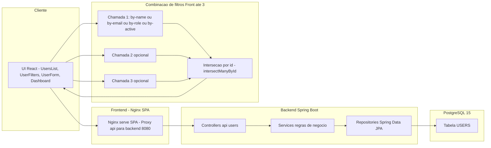
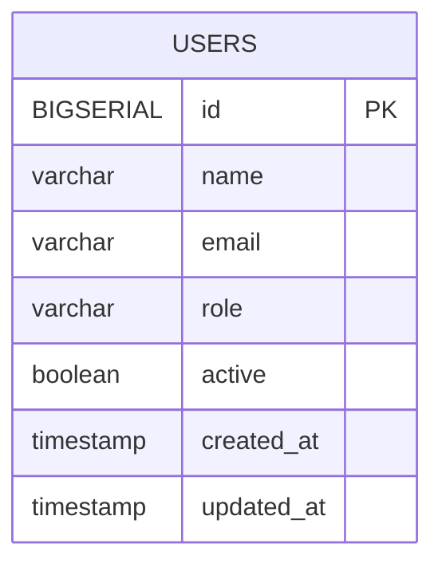

# Gestão de Usuários — Dashboard (Java + React + PostgreSQL + Docker)


Aplicação **full-stack** com **Spring Boot (Java)**, **React (Vite + TypeScript)** e **PostgreSQL 15**.  
Inclui **CRUD de usuários**, **dashboard com gráficos (Recharts)**, **documentação de API (Swagger)** e execução com **Docker Compose** (backend, frontend e banco).  
No frontend é possível **filtrar por nome, e-mail, função (role) e status (ativo/inativo)**, e **combinar até 3 filtros** (interseção por `id` no cliente).

---

## 🧭 Sumário
- [Visão geral](#visão-geral)
- [Diagramas](#diagramas)
  - [Fluxo do projeto](#fluxo-do-projeto)
  - [Modelo ER do banco](#modelo-er-do-banco)
- [Tecnologias & versões](#tecnologias--versões)
- [Estrutura do repositório](#estrutura-do-repositório)
- [Pré-requisitos](#pré-requisitos)
- [Como executar (Docker)](#como-executar-docker)
- [URLs úteis](#urls-úteis)
- [Configuração (compose, backend, proxy)](#configuração-compose-backend-proxy)
- [Rotas do Frontend](#rotas-do-frontend)
- [API & Endpoints](#api--endpoints)
- [Testes rápidos (curl)](#testes-rápidos-curl)
- [Desenvolvimento local (opcional)](#desenvolvimento-local-opcional)
- [Troubleshooting](#troubleshooting)
- [Segurança & boas práticas](#segurança--boas-práticas)
- [Licença](#licença)

---

## 📌 Visão geral
Este projeto implementa uma **gestão de usuários** com:
- **CRUD completo** (listar, criar, editar, remover);
- **Dashboard** com **KPIs** e **gráficos** (distribuição por **função/role** e por **status ativo/inativo**);
- **Filtros independentes** via backend (endpoints dedicados) e **combinação de até 3 filtros no frontend** (interseção por `id`);
- **API REST** documentada (Swagger/OpenAPI);
- Infraestrutura **containerizada** com **Docker Compose**, sem instalar Java ou Postgres localmente.

---

## 🔹 Diagramas

###  Fluxo do projeto
Mostra o caminho das requisições no **SPA** (Nginx), o **proxy para a API**, os **endpoints de filtro** e o **cálculo de interseção no frontend** quando o usuário escolhe 2 ou 3 filtros.



### Modelo ER do banco
Modelo mínimo usado pela aplicação (o dashboard e os filtros derivam desta tabela).


> Observação: as estatísticas do dashboard (**por role** e **ativo/inativo**) são **consultas agregadas** em cima de `USERS` (não há tabelas adicionais obrigatórias).

---

## 🧑‍💻 Tecnologias & versões
- **Java:** 17  
- **Spring Boot:** 3.x (Web, Data JPA, Validation)  
- **PostgreSQL:** 15  
- **React:** 18/19 (Vite + TypeScript, React Router)  
- **Charts:** Recharts  
- **Infra:** Docker, Docker Compose, **Nginx** (serve SPA e faz proxy `/api` → `backend:8080/api`)  
- **Swagger:** SpringDoc OpenAPI

> Ajuste as versões acima conforme seu `pom.xml` e `package.json`.

---

## 📁 Estrutura do repositório
```
gestao-usuarios-dashboard/
├─ db/
│  └─ init.sql                     # seed inicial (se não usar Flyway)
├─ backend/                        # Spring Boot
│  ├─ src/main/java/com/example/users/...
│  ├─ src/main/resources/
│  │  └─ application-docker.properties
│  └─ pom.xml
├─ frontend/                       # React + Vite + Nginx
│  ├─ src/
│  │  ├─ api/
│  │  │  ├─ client.ts             # axios instanciado (baseURL)
│  │  │  └─ userApi.ts            # ← chamadas HTTP centralizadas
│  │  ├─ components/
│  │  │  └─ UserFilters.tsx       # ← filtros (1 a 3) c/ interseção por id
│  │  ├─ pages/
│  │  │  ├─ UsersList.tsx
│  │  │  ├─ UserForm.tsx
│  │  │  └─ Dashboard.tsx
│  │  ├─ utils/
│  │  │  └─ intersect.ts          # ← intersectManyById
│  │  ├─ styles/
│  │  │  ├─ user.css
│  │  │  └─ dashboard.css
│  ├─ nginx.conf                   # fallback SPA + proxy /api -> backend
│  ├─ Dockerfile                   # build (Vite) + serve (Nginx)
│  └─ package.json
├─ docker-compose.yml
└─ README.md
```

---

## 🔹 Pré-requisitos
- **Docker** e **Docker Compose** instalados.  
- Não é necessário instalar Java, Node ou PostgreSQL localmente para rodar via Docker.

---

## ▶️ Como executar (Docker)
Na **raiz** do projeto:

```bash
docker compose up --build -d
```

> Para resetar o banco (apagar volume):
> ```bash
> docker compose down -v
> ```

Serviços:
- **db** (PostgreSQL): `5432`
- **backend** (Spring Boot): `http://localhost:8080`
- **frontend** (Nginx servindo React): `http://localhost:3000`

---

## URLs úteis
- **Frontend (SPA):** http://localhost:3000  
- **API (REST):** http://localhost:8080/api/users  
- **Swagger:**  
  - http://localhost:8080/swagger-ui/index.html  
  - *(algumas versões)* http://localhost:8080/swagger-ui.html

---

## ⚙️ Configuração (compose, backend, proxy)

### docker-compose.yml (resumo)
- `frontend` expõe **3000:80** (Nginx).
- `backend` expõe **8080:8080** e roda com `SPRING_PROFILES_ACTIVE=docker`.
- `db` expõe **5432:5432** e usa volume `db_data` + **healthcheck**:
  ```yaml
  healthcheck:
    test: ["CMD", "pg_isready", "-U", "appuser", "-d", "appdb"]
    interval: 5s
    timeout: 5s
    retries: 20
  ```

### 🧰 Backend (`backend/src/main/resources/application-docker.properties`)
```properties
spring.application.name=Users Backend
spring.datasource.url=${SPRING_DATASOURCE_URL:jdbc:postgresql://db:5432/appdb}
spring.datasource.username=${SPRING_DATASOURCE_USERNAME:appuser}
spring.datasource.password=${SPRING_DATASOURCE_PASSWORD:apppass}
spring.jpa.hibernate.ddl-auto=none
spring.jpa.properties.hibernate.jdbc.lob.non_contextual_creation=true
spring.jpa.show-sql=false
spring.datasource.driver-class-name=org.postgresql.Driver
server.port=8080

# Swagger / OpenAPI (SpringDoc)
springdoc.api-docs.enabled=true
springdoc.swagger-ui.enabled=true
```

### 🌐 Frontend — proxy SPA (Nginx)
`frontend/nginx.conf` contém fallback SPA e proxy de **`/api` → `backend:8080/api`**.  
Isso evita problemas de CORS, pois o navegador acessa somente a mesma origem do **frontend** (`localhost:3000`).

---

## 🖥️ Rotas do Frontend
- `/` — **Dashboard** (cards + gráficos por função e por status)
- `/users` — **Listagem** (ações de editar/excluir)
- `/users/new` — **Formulário** para criar
- `/users/:id` — **Formulário** para editar

---

## 🔌 API & Endpoints

| Método | Rota                   | Descrição                               |
|------:|------------------------|-----------------------------------------|
| GET   | `/api/users`           | Lista usuários                          |
| GET   | `/api/users/{id}`      | Detalha usuário                         |
| POST  | `/api/users`           | Cria usuário                            |
| PUT   | `/api/users/{id}`      | Atualiza usuário                        |
| PATCH | `/api/users/{id}`      | Atualiza parcial                        |
| DELETE| `/api/users/{id}`      | Remove usuário                          |
| GET   | `/api/users/stats`     | Estatísticas (dashboard/gráficos)       |
| GET   | `/api/users/by-name`   | Filtro por **nome** (não combinado)     |
| GET   | `/api/users/by-email`  | Filtro por **e-mail** (não combinado)   |
| GET   | `/api/users/by-role`   | Filtro por **função/role** (não comb.)  |
| GET   | `/api/users/by-active` | Filtro por **status ativo** (não comb.) |

> **Combinação de 2–3 filtros é feita no frontend** chamando **2 ou 3 endpoints** e aplicando **interseção por `id`**.

### Exemplo `POST /api/users`
```json
{
  "name": "Ana",
  "email": "ana@example.com",
  "role": "user",
  "active": true
}
```

**Erros** (exemplos):  
- `400` dados inválidos (ex.: email inválido/duplicado)  
- `404` não encontrado  
- `409` conflito  
- `500` erro interno

---

## 🧪 Testes rápidos (curl)
```bash
# listar
curl http://localhost:8080/api/users

# criar
curl -X POST http://localhost:8080/api/users \
  -H "Content-Type: application/json" \
  -d '{"name":"Ana","email":"ana@example.com","role":"user","active":true}'

# estatísticas
curl http://localhost:8080/api/users/stats

# filtro por nome (atenção ao espaço: encode %20)
curl "http://localhost:8080/api/users/by-name?name=Gabriel%20Alves"

# filtro por e-mail (caracter @ precisa de encode %40 se escrever na URL crua)
curl "http://localhost:8080/api/users/by-email?email=gabriel%40empresa.com"
```

---

## 🖥️ Desenvolvimento local (opcional)
Para rodar o **frontend via Vite** (sem Docker) apontando para o backend local:

1) Crie `.env.local` em `frontend/`:
```
VITE_API_BASE_URL=http://localhost:8080/api
```

2) No cliente HTTP (`client.ts`), use:
```ts
const baseURL = import.meta.env.VITE_API_BASE_URL ?? '/api';
```

3) Execute:
```bash
npm ci
npm run dev
```

---

## 🧭 Troubleshooting
- **Frontend 404 (ex.: /users)** → Nginx precisa de fallback SPA:
  ```nginx
  location / { try_files $uri /index.html; }
  ```
- **Frontend sem dados** → garanta proxy `/api` no Nginx e o `baseURL` do Axios (`/api` no Docker, `VITE_API_BASE_URL` no dev).
- **CORS no navegador** → use sempre `/api` (same-origin via Nginx).
- **Postgres ainda não pronto** → use o **healthcheck** do compose para evitar corrida.
- **Swagger não abre** → verifique a URL conforme a versão do SpringDoc e a dependência no `pom.xml`.

---

## 🔒 Segurança & boas práticas
- Não comitar segredos; usar variáveis de ambiente.
- Validar input na API (Bean Validation) e padronizar erros.
- Logs úteis em produção (sem dados sensíveis).
- Camadas no backend bem separadas (Controller, Service, Repository).
- No frontend, centralizar requisições em **`src/api/userApi.ts`**.
- Componentes reutilizáveis: **UserFilters**, tabela, cards, charts.
- Interseção de filtros no cliente com **`intersectManyById`**.

---

## 📄 Licença

Este projeto está sob a licença [MIT](LICENSE) 
Criado por **Gabriel Alves Varella da Costa** com fins educacionais.