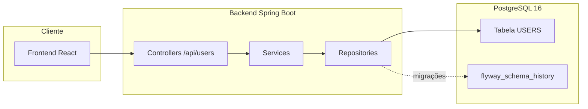

# Users Backend


-CC0200?logo=flyway)

## 📌 Descrição do Projeto

Backend do sistema de **Gestão de Usuários**, com **CRUD**, **filtros dedicados** (não combinados), **endpoint de estatísticas** para o dashboard e integração com **PostgreSQL** via **Flyway** para versionamento de esquema.  
Stack: **Java 17 / Spring Boot / Spring Data JPA / Flyway**. Execução via **Docker Compose** ou local.

---

## 🧭 Arquitetura (resumo)



---

## 🏗️ Estrutura do Projeto

```
backend/
├─ src/main/java/com/example/users/
│  ├─ controller/             # Endpoints REST
│  ├─ service/                # Regras de negócio
│  ├─ repository/             # Acesso ao banco (Spring Data JPA)
│  ├─ model/                  # Entidades JPA
│  ├─ dto/                    # DTOs de entrada/saída
│  ├─ exception/              # Exception + GlobalExceptionHandler
│  └─ UsersBackendApplication.java
├─ src/main/resources/
│  ├─ application-docker.properties      # Perfil p/ Docker
│  └─ db/migration/                      # **Migrações Flyway**
│     ├─ V1__create_users.sql
│     └─ V2__insert_users.sql
└─ pom.xml
```

> ⚠️ Usamos **Flyway** — não é necessário `schema.sql`/`data.sql`. Cada mudança de banco deve virar um novo arquivo `Vx__descricao.sql`.

---

## ⚙️ Funcionalidades

- Listar todos os usuários (`GET /api/users`)
- Buscar usuário por ID (`GET /api/users/{id}`)
- Criar usuário (`POST /api/users`)
- Atualizar usuário (`PUT /api/users/{id}`)
- Atualização parcial (`PATCH /api/users/{id}`)
- Excluir usuário (`DELETE /api/users/{id}`)
- **Estatísticas** (`GET /api/users/statistics`)
- **Filtros dedicados (não combinados)**:
  - `GET /api/users/by-name?name=...`
  - `GET /api/users/by-email?email=...`
  - `GET /api/users/by-role?role=...`
  - `GET /api/users/by-active?active=true|false`

> Observação: combinação/interseção de filtros é feita **no frontend** pela interseção por `id`.

---

## 📡 Endpoints (resumo rápido)

### CRUD
| Método | Rota                      | Descrição                  |
|-------:|---------------------------|----------------------------|
| GET    | `/api/users`              | Lista todos                |
| GET    | `/api/users/{id}`         | Detalhe por ID             |
| POST   | `/api/users`              | Cria                       |
| PUT    | `/api/users/{id}`         | Atualiza (replace)         |
| PATCH  | `/api/users/{id}`         | Atualiza parcialmente      |
| DELETE | `/api/users/{id}`         | Exclui                     |

### Filtros
| Método | Rota                              | Querystring                       | Exemplo                                   |
|-------:|-----------------------------------|-----------------------------------|-------------------------------------------|
| GET    | `/api/users/by-name`              | `name`                            | `/api/users/by-name?name=ana`             |
| GET    | `/api/users/by-email`             | `email`                           | `/api/users/by-email?email=ana@ex.com`    |
| GET    | `/api/users/by-role`              | `role` (ex.: `USER`, `ADMIN`)     | `/api/users/by-role?role=ADMIN`           |
| GET    | `/api/users/by-active`            | `active` (`true` ou `false`)      | `/api/users/by-active?active=true`        |

### Estatísticas
| Método | Rota                        | Descrição                                        |
|-------:|-----------------------------|--------------------------------------------------|
| GET    | `/api/users/statistics`     | Totais por `role` e por `active`                 |

**Exemplo de resposta (statistics):**
```json
{
  "byRole": [
    { "role": "ADMIN", "count": 2 },
    { "role": "USER", "count": 8 }
  ],
  "byActive": {
    "active": 7,
    "inactive": 3
  }
}
```

---

## 🚀 Execução com Docker Compose

1) Clone o repositório:
```bash
git clone https://github.com/Gabriel1000000/gestao-usuarios-dashboard.git
cd gestao-usuarios-dashboard
```

2) Suba os serviços:
```bash
docker compose up -d --build
# (ou) docker-compose up -d --build
```

3) Acesse:
- API: [http://localhost:8080/api/users](http://localhost:8080/api/users)
- Swagger: [http://localhost:8080/swagger-ui.html](http://localhost:8080/swagger-ui.html) ( ou [http://localhost:8080/swagger-ui/index.html](http://localhost:8080/swagger-ui/index.html) )

### Perfil `docker` (application-docker.properties)
```properties
spring.application.name=Users Backend
server.port=8080

# DataSource: lê env com fallback para 'db' (host do serviço PostgreSQL)
spring.datasource.url=${SPRING_DATASOURCE_URL:jdbc:postgresql://db:5432/appdb}
spring.datasource.username=${SPRING_DATASOURCE_USERNAME:appuser}
spring.datasource.password=${SPRING_DATASOURCE_PASSWORD:apppass}
spring.datasource.driver-class-name=org.postgresql.Driver

# JPA/Hibernate
spring.jpa.hibernate.ddl-auto=none
spring.jpa.show-sql=false
spring.jpa.properties.hibernate.jdbc.lob.non_contextual_creation=true

# Flyway
spring.flyway.enabled=true
spring.flyway.locations=classpath:db/migration
# Se já existia schema antes do Flyway, habilite **temporariamente**:
# spring.flyway.baseline-on-migrate=true
```

> O serviço do banco no `docker-compose.yml` deve se chamar **`db`** e expor a porta `5432`. O backend sobe com `SPRING_PROFILES_ACTIVE=docker`.

---

## ▶️ Execução local (sem Docker)

Pré-requisitos: **Java 17** + **PostgreSQL 16**.

1) Configure `src/main/resources/application.properties`:
```properties
spring.datasource.url=jdbc:postgresql://localhost:5432/appdb
spring.datasource.username=appuser
spring.datasource.password=apppass
spring.datasource.driver-class-name=org.postgresql.Driver

spring.jpa.hibernate.ddl-auto=none
spring.jpa.show-sql=true

spring.flyway.enabled=true
spring.flyway.locations=classpath:db/migration
```

2) Rode a aplicação:
```bash
./mvnw spring-boot:run
# ou
mvn spring-boot:run
```

---

## 🗃️ Migrações (Flyway)

- Migrações ficam em `src/main/resources/db/migration`.
- Criando a tabela users: `V1__create_users.sql` (tabela, índices, unicidade por e-mail case-insensitive).
- Inserindo usuários de exemplo: `V2__insertd_users.sql`.
- **Regra de ouro:** toda alteração de banco = **novo** `Vx__descricao.sql`.  
  Não edite migrações já aplicadas.

**Índice recomendado (case-insensitive) para e-mail:**
```sql
CREATE UNIQUE INDEX IF NOT EXISTS ux_users_email_ci ON users (LOWER(email));
```

---

## 🧪 Exemplos de teste (curl)

```bash
# Listar
curl -s http://localhost:8080/api/users | jq

# Criar
curl -s -X POST http://localhost:8080/api/users   -H "Content-Type: application/json"   -d '{"name":"Ana","email":"ana@example.com","role":"USER","active":true}' | jq

# Atualizar parcial (PATCH)
curl -s -X PATCH http://localhost:8080/api/users/1   -H "Content-Type: application/json"   -d '{"active":false}' | jq

# Filtro por role
curl -s "http://localhost:8080/api/users/by-role?role=ADMIN" | jq

# Estatísticas
curl -s http://localhost:8080/api/users/statistics | jq
```

---

## 🔍 Troubleshooting

- **Unsupported Database: PostgreSQL 16.x (Flyway)**  
  Garanta dependências **modulares** do Flyway:
  - `org.flywaydb:flyway-core`
  - `org.flywaydb:flyway-database-postgresql`  
  (mesma versão para ambos)

- **Hibernate criando tabela junto do Flyway**  
  Use `spring.jpa.hibernate.ddl-auto=none`.

- **Começando em DB já existente**  
  Habilite **temporariamente** `spring.flyway.baseline-on-migrate=true`.

- **Conexão com DB falhou no Docker**  
  Verifique host `db`, porta `5432` e credenciais.

- **Swagger 404**  
  Teste `/swagger-ui.html` e `/swagger-ui/index.html`.  
  Verifique se o `springdoc` está incluído no `pom.xml`.

---

## 📊 Tecnologias Utilizadas

- Java 17
- Spring Boot 3.x
- Spring Data JPA
- Flyway (migrations)
- PostgreSQL 16
- SpringDoc OpenAPI / Swagger UI
- Docker / Docker Compose
- Maven

---

## 📄 Licença

Este projeto está sob a licença [MIT](LICENSE). <\br>
Criado por **Gabriel Alves Varella da Costa**.
