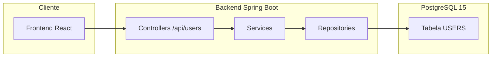

# Users Backend


## 📌 Descrição do Projeto

Backend do sistema de **Gestão de Usuários**, com **CRUD**, **filtros dedicados** (não combinados), **endpoint de estatísticas** para o dashboard e integração com **PostgreSQL**.
Desenvolvido em **Java 17 / Spring Boot / Spring Data JPA**. Execução facilitada via **Docker Compose**.

---

## 🧭 Arquitetura (resumo)



---

## 🏗️ Estrutura do Projeto

```
backend/
├─ src/main/java/com/example/users/
│  ├─ controller/             # Endpoints REST
│  ├─ service/                # Regras de negócio
│  ├─ repository/             # Acesso ao banco (Spring Data JPA)
│  ├─ model/                  # Entidades JPA
│  ├─ dto/                    # DTOs de entrada/saída
│  ├─ exception/              # Exception + GlobalExceptionHandler
│  └─ UsersBackendApplication.java
├─ src/main/resources/
│  ├─ application-docker.properties  # Perfil p/ Docker
│  ├─ application.properties         # (opcional local)
│  └─ data.sql / schema.sql          # (opcional seed/migrations simples)
└─ pom.xml
```

---

## ⚙️ Funcionalidades

- Listar todos os usuários (`GET /api/users`)
- Buscar usuário por ID (`GET /api/users/{id}`)
- Criar usuário (`POST /api/users`)
- Atualizar usuário (`PUT /api/users/{id}`)
- Atualização parcial (`PATCH /api/users/{id}`)
- Excluir usuário (`DELETE /api/users/{id}`)
- **Estatísticas** para dashboard (`GET /api/users/statistics`)
- **Filtros dedicados (não combinados)**:
  - `GET /api/users/by-name?name=...`
  - `GET /api/users/by-email?email=...`
  - `GET /api/users/by-role?role=...`
  - `GET /api/users/by-active?active=true|false`
- **Swagger / OpenAPI**:
  - `http://localhost:8080/swagger-ui.html` **ou**
  - `http://localhost:8080/swagger-ui/index.html`

> Observação: combinação de filtros é feita **no frontend** por interseção de resultados (por `id`).

---

## 📡 Endpoints (resumo rápido)

### CRUD
| Método | Rota                      | Descrição                  |
|-------:|---------------------------|----------------------------|
| GET    | `/api/users`              | Lista todos                |
| GET    | `/api/users/{id}`         | Detalhe por ID             |
| POST   | `/api/users`              | Cria                       |
| PUT    | `/api/users/{id}`         | Atualiza (replace)         |
| PATCH  | `/api/users/{id}`         | Atualiza parcialmente      |
| DELETE | `/api/users/{id}`         | Exclui                     |

### Filtros
| Método | Rota                              | Querystring                       | Exemplo                                   |
|-------:|-----------------------------------|-----------------------------------|-------------------------------------------|
| GET    | `/api/users/by-name`              | `name`                            | `/api/users/by-name?name=ana`             |
| GET    | `/api/users/by-email`             | `email`                           | `/api/users/by-email?email=ana@ex.com`    |
| GET    | `/api/users/by-role`              | `role` (ex.: `USER`, `ADMIN`)     | `/api/users/by-role?role=ADMIN`           |
| GET    | `/api/users/by-active`            | `active` (`true` ou `false`)      | `/api/users/by-active?active=true`        |

### Estatísticas
| Método | Rota                        | Descrição                                        |
|-------:|-----------------------------|--------------------------------------------------|
| GET    | `/api/users/statistics`     | Totais por `role` e por `active`                 |

**Exemplo de resposta (statistics):**
```json
{
  "byRole": [
    { "role": "ADMIN", "count": 2 },
    { "role": "USER", "count": 8 }
  ],
  "byActive": {
    "active": 7,
    "inactive": 3
  }
}
```

---

## 🛡️ Validações & Erros

- **E-mail duplicado:** ao criar/atualizar, o serviço valida existência de e-mail:
  - `409 Conflict` (ou `400`) com mensagem clara.
- **Not Found:** `404` quando `id` inexistente.
- **Dados inválidos:** `400 Bad Request` (violação de Bean Validation / payload incorreto).
- **Erro interno:** `500 Internal Server Error`.

> Tratados via `GlobalExceptionHandler` (ex.: `@ControllerAdvice`).

---

## 🚀 Execução com Docker Compose

1) Clone o repositório:
```bash
git clone https://github.com/Gabriel1000000/gestao-usuarios-dashboard.git
cd gestao-usuarios-dashboard
```

2) Suba os serviços (db + backend + frontend se definido no compose):
```bash
docker-compose up --build
```

3) Acesse:
- API: `http://localhost:8080/api/users`
- Swagger: `http://localhost:8080/swagger-ui.html` (ou `/swagger-ui/index.html`)

### Variáveis usadas no perfil `docker` (exemplo)
`src/main/resources/application-docker.properties`:
```properties
spring.datasource.url=jdbc:postgresql://db:5432/usersdb
spring.datasource.username=postgres
spring.datasource.password=postgres
spring.jpa.hibernate.ddl-auto=update
spring.jpa.show-sql=true
springdoc.swagger-ui.path=/swagger-ui.html
server.port=8080
```

> O serviço do banco no docker-compose costuma se chamar `db` e expõe a porta `5432`.

---

## ▶️ Execução local (sem Docker)

Pré-requisitos: **Java 17** + **PostgreSQL 15** locais.

1) Configure `src/main/resources/application.properties`:
```properties
spring.datasource.url=jdbc:postgresql://localhost:5432/usersdb
spring.datasource.username=postgres
spring.datasource.password=postgres
spring.jpa.hibernate.ddl-auto=update
spring.jpa.show-sql=true
springdoc.swagger-ui.path=/swagger-ui.html
```

2) Rode a aplicação:
```bash
./mvnw spring-boot:run
# ou
mvn spring-boot:run
```

---

## 🧪 Exemplos de teste (curl)

```bash
# Listar
curl -s http://localhost:8080/api/users | jq

# Criar
curl -s -X POST http://localhost:8080/api/users \
  -H "Content-Type: application/json" \
  -d '{"name":"Ana","email":"ana@example.com","role":"USER","active":true}' | jq

# Atualizar parcial (PATCH)
curl -s -X PATCH http://localhost:8080/api/users/1 \
  -H "Content-Type: application/json" \
  -d '{"active":false}' | jq

# Filtro por role
curl -s "http://localhost:8080/api/users/by-role?role=ADMIN" | jq

# Estatísticas
curl -s http://localhost:8080/api/users/statistics | jq
```

---

## 🔍 Troubleshooting

- **Erro de conexão com DB**: confirme host `db`, usuário/senha e se a porta `5432` está exposta.
- **Swagger 404**: teste ambas as URLs (`/swagger-ui.html` e `/swagger-ui/index.html`), ou verifique o `springdoc.swagger-ui.path`.
- **E-mail duplicado**: verifique se a validação está via `existsByEmailIgnoreCase(...)` no `Repository` e tratada no `Service`.
- **CORS** (se acessando direto do browser local): habilite `@CrossOrigin` ou configure `CorsConfigurationSource` no backend; **em produção** prefira proxy via Nginx no frontend.

---

## 📊 Tecnologias Utilizadas

- Java 17
- Spring Boot 3.x
- Spring Data JPA
- PostgreSQL 15
- SpringDoc OpenAPI / Swagger UI
- Docker / Docker Compose

---

## 📄 Licença

Este projeto está sob a licença [MIT](LICENSE) </br>
Criado por **Gabriel Alves Varella da Costa**.
