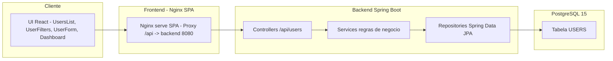

# Frontend — Gestão de Usuários (React + Vite + Nginx)


SPA em **React (Vite + TypeScript)** com rotas, formulários e gráficos, consumindo a API de usuários.

- Rotas: **Dashboard**, **Usuários (lista)**, **Formulário (novo/editar)**
- Formulários com **react-hook-form + zod**
- Gráficos com **recharts**
- Deploy via **Nginx** (fallback SPA + proxy `/api` → backend)

---

## 🧭 Arquitetura (resumo)



---

## 🔎 Filtros de busca (frontend + backend)

O backend expõe **filtros não combinados**; o frontend pode **combinar até 3** chamando endpoints diferentes e **intersectando por `id`**:

- **Endpoints de filtro (backend):**
  - `GET /by-name?name=...`
  - `GET /by-email?email=...`
  - `GET /by-role?role=...`
  - `GET /by-active?active=true|false`

- **Combinação no frontend (exemplo de lógica):**
  1. Executa a chamada principal (ex.: `/by-name`).
  2. Opcionalmente executa 1–2 filtros adicionais.
  3. **Interseção por `id`** (somente usuários presentes em todas as respostas).
  
  > Implementação típica: `intersectManyById([lista1, lista2, lista3])`.

---

## ▶️ Executar em desenvolvimento (Vite)

1) Criar arquivo `.env.local` (se rodar backend local):
```
VITE_API_BASE_URL=http://localhost:8080/api
```
> Alternativamente, você pode usar proxy via Nginx em dev Docker. Em ambiente puro Vite, prefira `VITE_API_BASE_URL`.

2) Instalar deps e iniciar:
```bash
cd frontend
npm install
npm run dev
```
Acesse: http://localhost:5173

---

## ▶️ Executar em produção (Docker + Nginx)

O `Dockerfile` faz build com Vite e serve via Nginx.  
O Nginx está configurado para:
- **Fallback SPA**: `try_files $uri /index.html;`
- **Proxy de API**: `/api` → `backend:8080/api`

### `docker-compose.yml` (serviço `frontend` esperado)
```yaml
frontend:
  build:
    context: ./frontend
    dockerfile: Dockerfile
    # (opcional) embutir URL de API no build:
    # args:
    #   - VITE_API_BASE_URL=http://backend:8080/api
  container_name: users_frontend
  depends_on:
    - backend
  ports:
    - "3000:80"
```

Acesse: http://localhost:3000

---

## ⚙️ Variáveis de ambiente e baseURL

- **Produção (Docker/Nginx):** usar **proxy** de `/api/*` para `backend:8080/api/*`.  
  No código, **baseURL = `/api`**.

- **Desenvolvimento (Vite rodando local):** defina:
  ```
  VITE_API_BASE_URL=http://localhost:8080/api
  ```
  e use isso no `axios`.

**Exemplo (`src/api/client.ts`)**:
```ts
import axios from 'axios'

const baseURL = import.meta.env.VITE_API_BASE_URL ?? '/api'

export const api = axios.create({
  baseURL,
  headers: { 'Content-Type': 'application/json' },
})
```

---

## 📂 Estrutura (resumo)

```
frontend/
├─ src/
│  ├─ api/
│  │  └─ client.ts        # Axios base (usa '/api' ou VITE_API_BASE_URL)
│  ├─ pages/
│  │  ├─ Dashboard.tsx     # gráficos por role e ativos
│  │  ├─ UsersList.tsx     # listagem + ações
│  │  └─ UserForm.tsx      # create/update com Zod
│  ├─ types.ts
│  ├─ main.tsx / App.tsx   # rotas (react-router)
│  └─ styles.css           # estilo base
├─ nginx.conf               # SPA fallback + proxy /api
├─ Dockerfile               # build (node) + serve (nginx)
├─ package.json
└─ vite.config.ts
```

---

## 🧪 Checklist funcional
- **Dashboard**: gráficos por `role` e por `active`.
- **Usuários**: listagem, editar, excluir.
- **Formulário**: validações **Zod** + submit (**POST/PUT**).
- **Filtros**: nome, e-mail, role, ativo/inativo.  
  *Opcional*: combinação de até 3 filtros via interseção por `id`.

---

## 🧭 Troubleshooting

- **404 ao recarregar rota SPA (ex.: `/users`)**  
  Confirme no `nginx.conf`:
  ```nginx
  location / { try_files $uri /index.html; }
  ```

- **Sem dados do backend**  
  Verifique se as requisições vão para **`/api/...`** (Network).  
  Se estiver indo para `http://backend:8080/api` direto do navegador, ajuste o **proxy** e use **`/api`**.

- **CORS em dev (Vite)**  
  Prefira proxy via Nginx no Docker. Se usar `VITE_API_BASE_URL` para `localhost:8080`, habilite **CORS** no backend.

---

## 📦 Scripts
```bash
npm run dev      # Vite dev server
npm run build    # Build produção
npm run preview  # Pré-visualizar build
```

---

## 📄 Licença

Este projeto está sob a licença [MIT](LICENSE) </br>
Criado por **Gabriel Alves Varella da Costa**.

---
